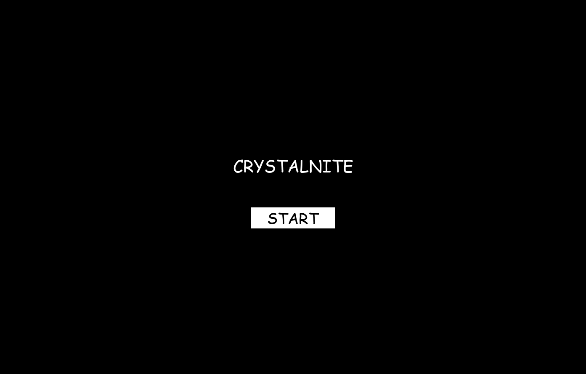
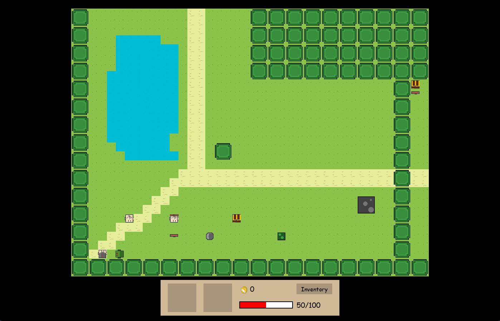

# Crystalnite
Crystalnite is an immersive 2D RPG adventure game, similar to the popular game Undertale, where you embark on a thrilling journey. Engage in exhilarating battles againt formidable foes, harness your strategic prowess, and hone your skills to emerge victorious. Your ultimate objective? Acquire the coveted crystal that lies at the game's climactic conclusion. 

# Features
* **Quest System:** Engage in various quests that involve exploring the world, gathering items, solving puzzles, and defeating enemies. Completing quests rewards the player with items, coins, and progression in the game's storyline.
* **Pathfinding AI:** Zombies, slimes, book monsters, and the necromancer use intelligent pathfinding algorithms to navigate to your location.
* **Battle UI:** Engage in turn-based battles with enemies encountered throughout the game.
* **Inventory and Equipment:** Manage your character's inventory and equip weapons to enhance your character's capabilities in battles.
* **Interactive World:** Explore a richly detailed world filled with structures, forests, and other intriguing locations. Interact with NPCs, discover hidden places, and reach the crystal at the end of the game.

# Controls
* **W, A, S, D:** Move the character in the corresponding direction.
* **Spacebar:** Action button for the in-game character.
* **Left Mouse Button:** Perform actions on the hotbar and inventory.

# Installation
1. Ensure you have Python 3.6 or higher installed on your system. Download it [here](https://www.python.org/downloads/).

2. Clone this repository.

    `git clone https://github.com/danielrzhang/crystalnite.git`
3. Navigate to the project's directory.

    `cd crystalnite`
4. Install Pygame.

    `pip install pygame`

5. Run the project.

    `python mainGame.py`

# Pictures

## Title Screen

## Gameplay

## Inventory

## Battle UI

## Attack Interface

## Puzzle Example

# License
Crystalnite is licensed under the GNU General Public License v3.0.